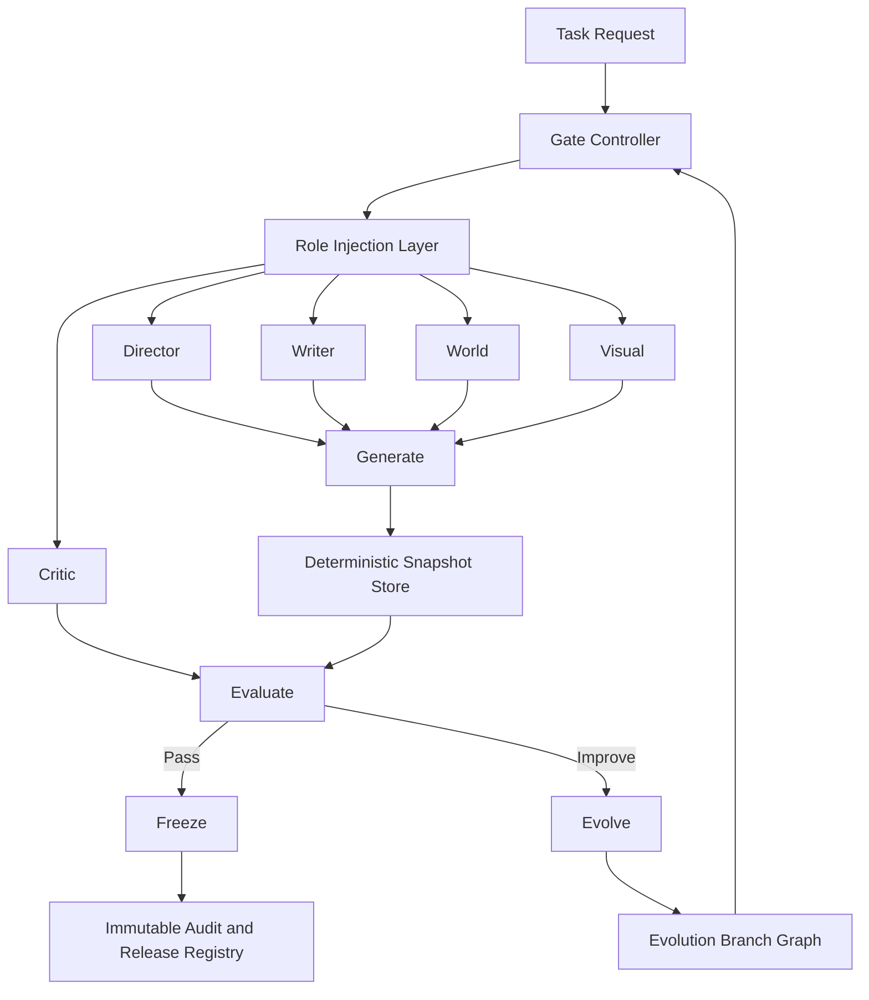

# Anamnesis Studio

Anamnesis Studio is a deterministic, gated AI agent system for production content pipelines. It is designed to move work through a controlled lifecycle rather than treating generation as a loose sequence of retries. Every execution is evaluated, every decision is recorded, every accepted state is frozen, and every improvement path branches from a known snapshot.

The system is built around four execution gates:

1. `Generate`: produce candidate outputs with a fixed agent set and task-scoped role injection.
2. `Evaluate`: score the candidate against policy, rubric, and system constraints.
3. `Freeze`: promote passing work into an immutable, replayable snapshot.
4. `Evolve`: branch from an accepted or candidate snapshot to improve without mutating history.

## System Overview

Anamnesis Studio uses five core agents:

| Agent | Responsibility |
| --- | --- |
| `Director` | Orchestrates the run, assigns roles, sequences work, and enforces stage transitions. |
| `Writer` | Produces narrative, structure, dialog, and textual artifacts. |
| `World` | Maintains canon, continuity, entities, setting rules, and factual coherence. |
| `Visual` | Produces visual specifications, shot logic, style directives, and asset instructions. |
| `Critic` | Evaluates output quality, policy compliance, continuity, and freeze readiness. |

The agent set stays intentionally small. Instead of multiplying agents for every new workflow, Anamnesis Studio injects task-specific roles into the core agents. This preserves operational simplicity while still allowing the system to adapt to different jobs, genres, formats, and evaluation criteria.

## Architecture

## Design Principles

### Deterministic execution

Each run is bound to a deterministic snapshot contract: versioned inputs, role injections, prompt hashes, evaluation rubric version, model identifiers, and artifact references are recorded as immutable state. A frozen snapshot can be replayed, audited, and compared without ambiguity.

### Gate-based control

No output becomes production state directly from generation. All candidate work must pass through evaluation before freeze. This makes the system inspectable and safe to operate at scale.

### Branching evolution

Anamnesis Studio does not "retry until it looks right." Improvement happens through explicit branching. Every branch has lineage, evaluation history, and clear parentage back to a frozen or candidate snapshot.

### Role injection over agent sprawl

The platform expands by changing task roles, constraints, rubrics, and policies rather than by adding a new agent for each feature. This keeps orchestration stable and reduces emergent complexity.

## Lifecycle

### 1. Generate

The Director opens a run, injects task-specific roles into the five core agents, and coordinates the first candidate output set.

### 2. Evaluate

The Critic scores the candidate against quality, continuity, policy, and task success metrics. Evaluation is a gate, not a suggestion.

### 3. Freeze

Passing runs are frozen into immutable snapshots. A frozen snapshot is the system's source of truth for release, reuse, replay, and audit.

### 4. Evolve

Failed or partially successful candidates move into evolution. Evolution creates branches from known state, preserving the original snapshot while allowing directed improvement.

## Deterministic Snapshots

A snapshot is the atomic unit of accountability in Anamnesis Studio. It records:

- task identity and requested outcome
- active role injections per agent
- model and tool versions
- generation inputs and artifact hashes
- evaluation scores and findings
- gate decision and freeze status
- parent snapshot lineage for evolution

See [examples/snapshot_example.json](/Users/mikejames/Anamnesis/examples/snapshot_example.json) for the reference structure.

## Repository Layout

- [README.md](/Users/mikejames/Anamnesis/README.md): system definition and operating model
- [docs/GATE_ARCHITECTURE.md](/Users/mikejames/Anamnesis/docs/GATE_ARCHITECTURE.md): gate contract, lifecycle semantics, and control rules
- [examples/snapshot_example.json](/Users/mikejames/Anamnesis/examples/snapshot_example.json): deterministic snapshot reference example

## Operating Position

Anamnesis Studio is not framed as an open-ended experimentation shell. It is a controlled execution system for repeatable agent work where lifecycle, evaluation, lineage, and evolution are first-class architectural concerns.
